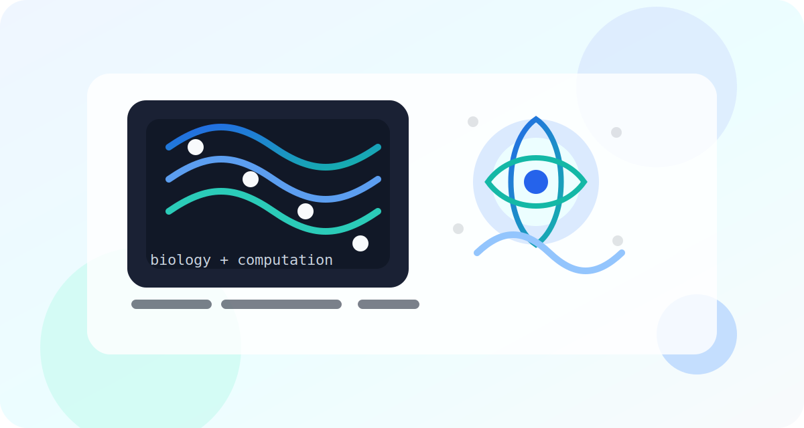

# bennykula.github.io

Hi, I’m benny. I study life science at WSoS and I also hold a BSc in computer science from the Open University.

You can read a little more [about me](about.md), including a short snapshot of my background and interests.

## Rotations

### Ranit Kedmi's lab
[Lab website](https://www.weizmann.ac.il/immunology/kedmi/)

I studied immune recognition between individuals and got a closer look at how the immune system distinguishes self from non-self.

### Amos Tanay's lab
[Lab website](https://www.weizmann.ac.il/math/tanay/home)

I studied [Borzoi](https://github.com/calico/borzoi), a convolutional neural network trained to predict RNA-seq coverage from DNA sequence.

### Noam Stern-Ginossar's lab
[Lab website](https://www.weizmann.ac.il/molgen/ginossar/)

This is my current rotation. I’m still learning the questions, methods, and datasets that shape the lab’s work.

## What this page will grow into

- Notes from rotations and coursework
- Small project writeups
- Links to things I’m learning along the way

> I’ll keep improving the site as I collect more material, so this page can become a better record of the work I’m doing.
